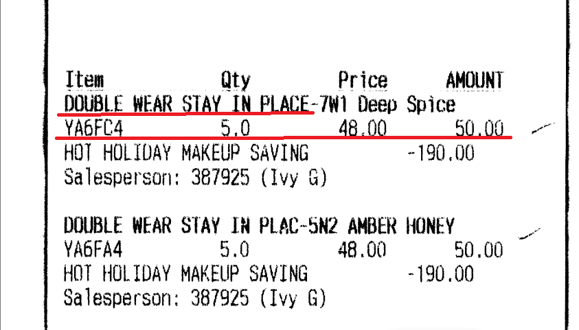

PDF2TEXT(Invoice) code
-----------------

This is <b>pdf2text</b> code using <b>easyocr</b>.

Example:
--------------------

<b style="text-align: center;">Style one</b>

<b style="text-align: center;">Style Two</b>

The requirement is to recognize text in these PDFs including images.

⭐️ Support
------------------
Give a ⭐️ if this project helped you!
